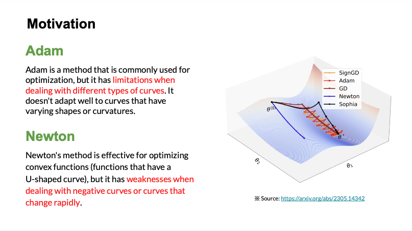
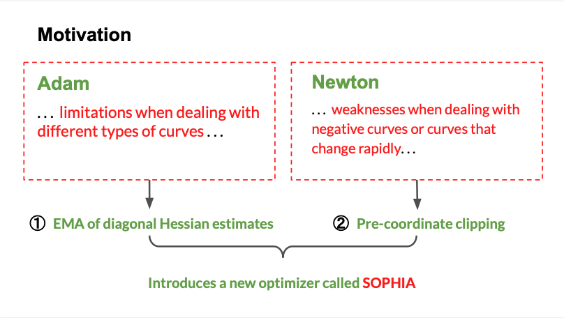
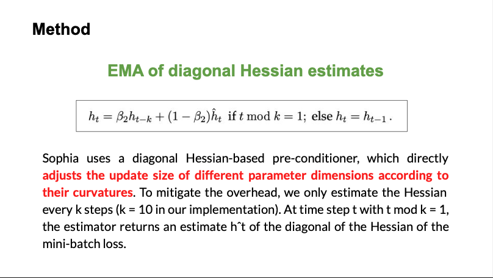
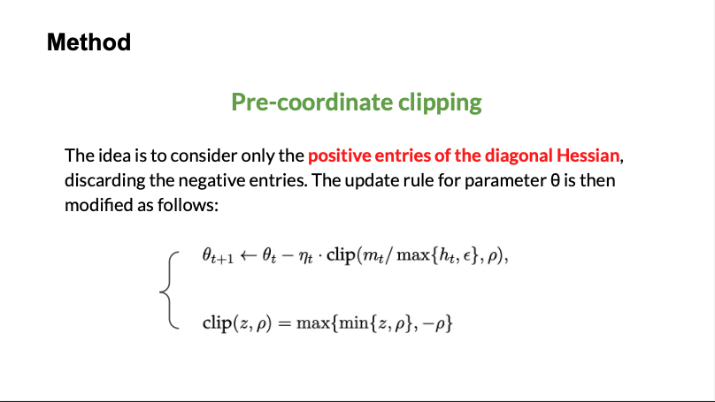
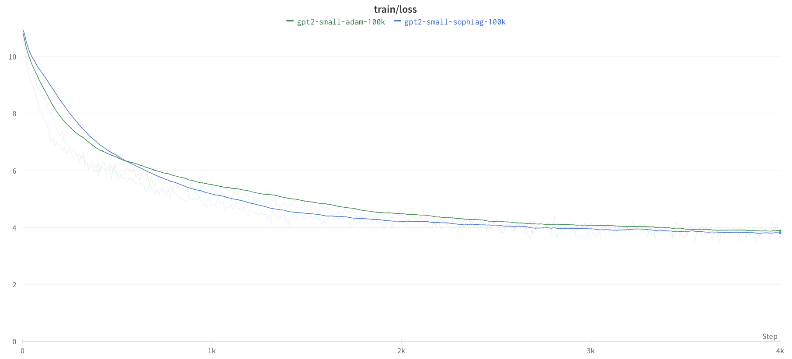
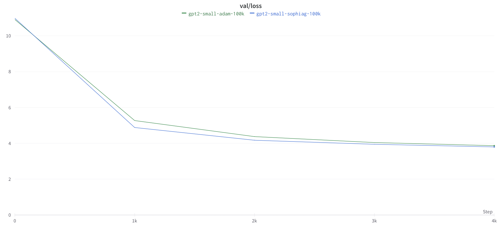
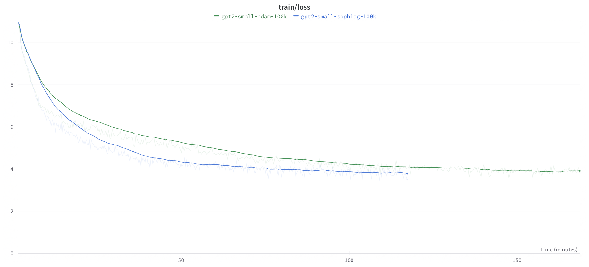

# Sophia: Explanation and Experiments

we will provide an explanation of the Sophia-G optimizer and present our experiments with GPT-2 training using Sophia and Adam optimizers on Google Colab. 

We would like to express our sincere appreciation to Liu Hong, Li Zhiyuan, Hall David, Liang Percy, and Ma Tengyu for their valuable contributions to this project. 👏

To cite the Sophia-G optimizer paper, please use the following BibTeX entry:

```tex
@article{liu2023sophia,
 title={Sophia: A Scalable Stochastic Second-order Optimizer for Language Model Pre-training},
 author={Liu, Hong and Li, Zhiyuan and Hall, David and Liang, Percy and Ma, Tengyu},
 journal={arXiv preprint arXiv:2305.14342},
 year={2023}
}
```

# Simple explanation
In this section, we will provide a brief and straightforward explanation of the Sophia-G optimizer.







# Experiment
For our experiments, we trained GPT-2 on the OpenWebText dataset using both the Sophia and Adam optimizers. 
The training setup involved using a single A6000 GPU with 48GB memory, 32GB RAM, and 7 CPU cores.





# Implementation Team

- Phan Quoc Tuan
  - Email: phanquoctuan20081998@gmail.com
  - LinkedIn: [Phan Quốc Tuấn](https://www.linkedin.com/in/tuấn-phan-quốc-153969138)
  - GitHub: [phanquoctuan-github](https://github.com/phanquoctuan20081998)
- Tran Duc Anh
  - Email: anhtrankoc@gmail.com
  - LinkedIn: [Trần Anh](https://www.linkedin.com/in/anhtrancntt/)
  - GitHub: [tranducanh-github](https://github.com/Helianthusss)


